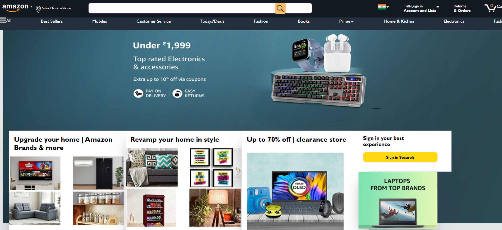

# Project Clones

This repository contains multiple project clones, including popular platforms and games like Amazon, Netflix, Spotify, Chess, Sudoku, and more.

## 📁 Project Structure
Each project is organized in its own directory. Below is an overview of the main folders:

- **Amazon** - Amazon website clone  

- **calculator** - A simple calculator project  
- **Chess** - Chess game with pieces and UI  
- **Cricket** - Cricket-related project  
- **Kidz-world** - A kids' entertainment site  
- **Netflix** - Netflix UI clone  
- **Spotify** - Spotify UI and functionality clone  
- **Sudoku** - A playable Sudoku game  
- **Superover** - A cricket game clone  
- **Superwars** - A battle-style game  
- **YouTube** - YouTube website UI clone  

